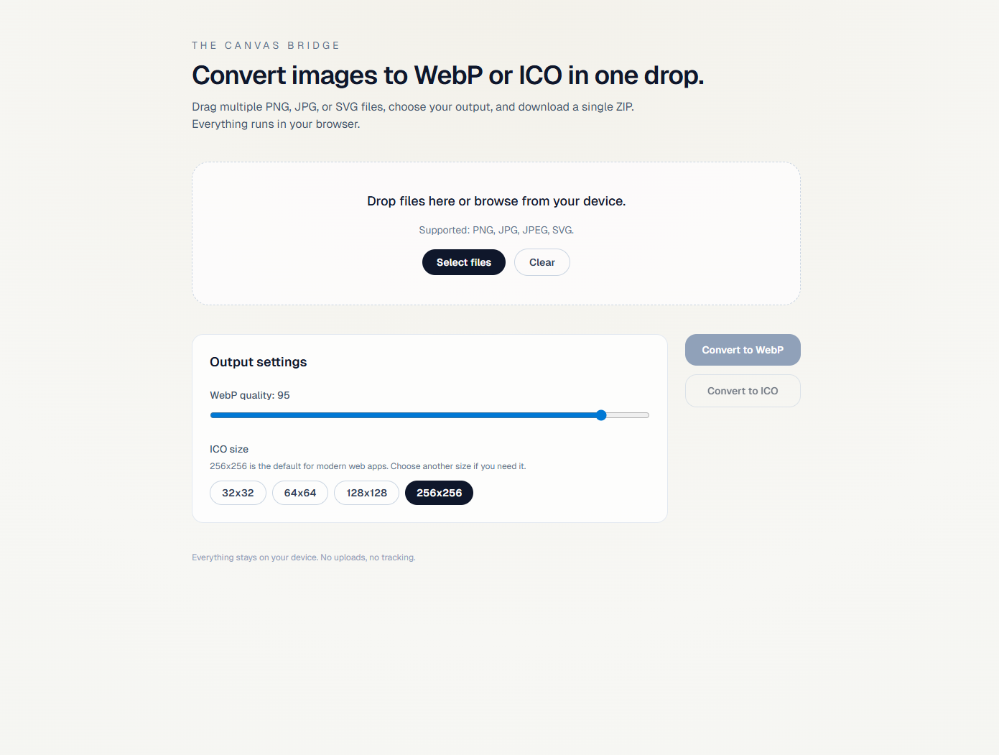

# filesconversion

Minimal, in-browser image conversion for developers. Convert `PNG`/`JPG`/`JPEG`/`SVG` into `WebP` or `ICO`, then download the result instantly.

## Features

- Drag-and-drop multiple files
- `WebP` conversion with quality control
- `ICO` generation with selectable sizes
- Batch downloads bundled into a ZIP
- Everything runs locally in the browser

## Screenshots



## Getting Started

🔗 Check it out live: [filesconversion](https://filesconversion.vercel.app/)

OR

```bash
pnpm install
pnpm dev
```

Open `http://localhost:3000` in your browser.

## Architecture

See [ARCHITECTURE](./ARCHITECTURE.md) for the technical overview.
